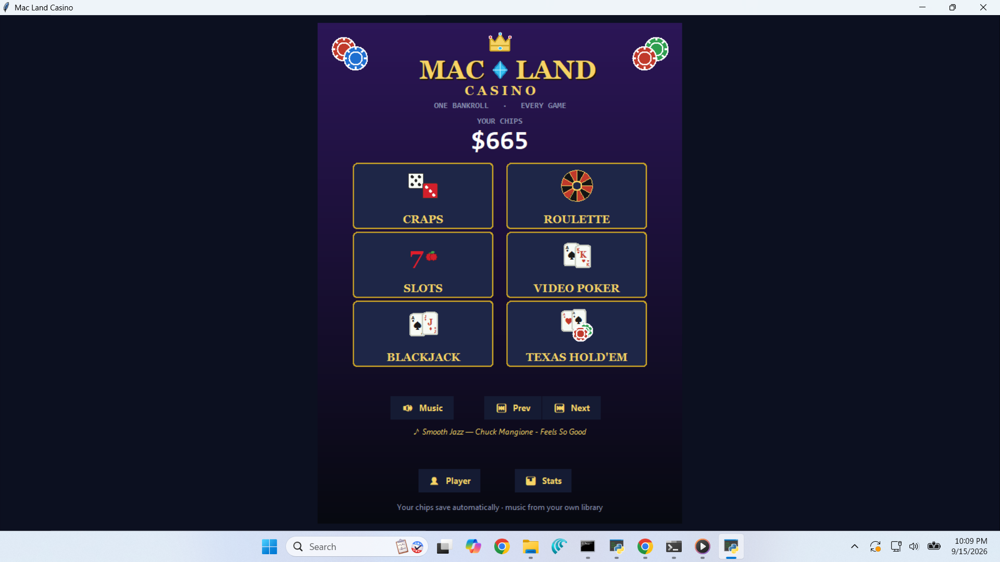
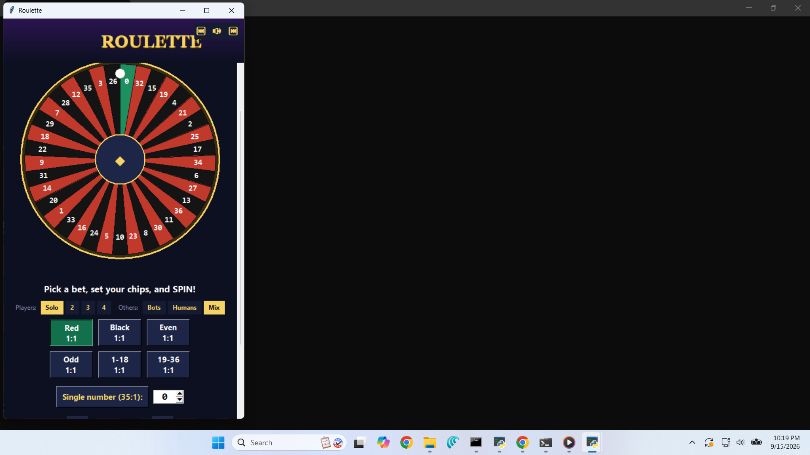
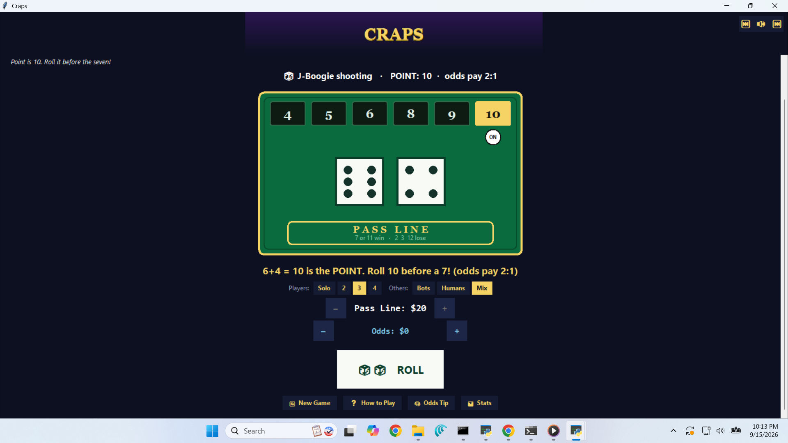
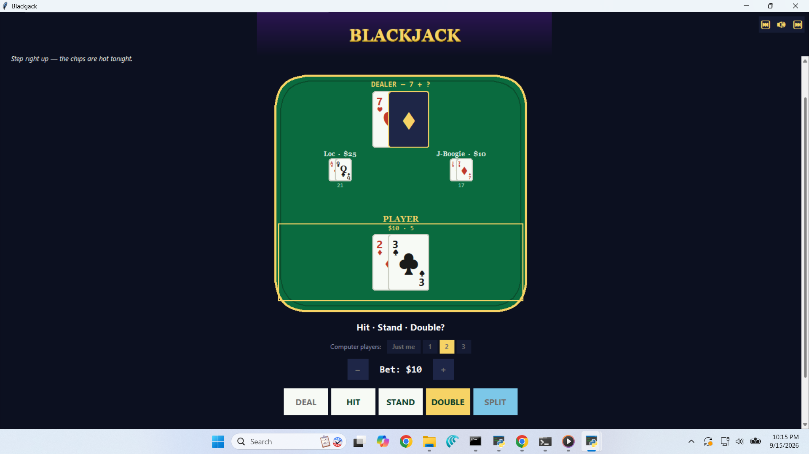
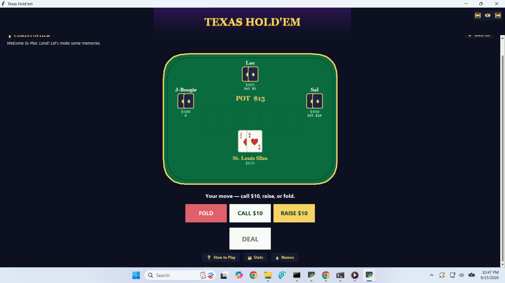

# 🎰 Mac ◆ Land Casino — A Multi-Game Desktop Casino in Python

Six playable casino games — **Craps, Roulette, Slots, Video Poker, Blackjack, and Texas Hold'em** — sharing one **persistent chip bankroll**, all launched from a luxe dark-and-gold lobby. Built in **pure Python** (tkinter). The only optional dependency is `edge-tts` for the neural dealer voice — everything else is the standard library, and the app degrades gracefully when extras aren't present.



<p align="center">
  
  
</p>
<p align="center">
  
  
</p>

<p align="center"><em>Roulette (drawn wheel) · multiplayer Craps (rotating shooters) · Blackjack with computer players · Texas Hold'em against bots — all with a shared bankroll and custom names.</em></p>

---

## The games

| Game | How it plays |
|------|--------------|
| 🎲 **Craps** | Full Pass Line game — come-out roll, points, seven-out, plus **true-odds** betting (2:1 / 3:2 / 6:5). **Multiplayer:** rotating shooters — the dice pass to the next player when a line resolves. |
| 🔴 **Roulette** | European single-zero wheel — red/black, even/odd, high/low (1:1) or a single number (35:1). **Multiplayer:** everyone bets, one shared spin resolves all players. |
| 🎰 **Slots** | A drawn slot-machine cabinet with a pull lever and three weighted reels — match three for a payout, chase the **7️⃣7️⃣7️⃣ 100× jackpot**. |
| 🃏 **Video Poker** | Jacks-or-Better — deal, **hold** the cards you want, draw, get paid by hand rank. |
| ♠ **Blackjack** | Hit / stand / **double** / **split** (with double-after-split and re-splits). Sit **1–3 computer players** at the table who play basic strategy. |
| ♦ **Texas Hold'em** | 4-handed **limit** Hold'em against three bots — hole cards, flop/turn/river betting, and a showdown decided by a full 7-card hand evaluator. |

## Signature features

- 🏦 **Shared, persistent bankroll** — win chips in one game, spend them in another; the balance **saves to disk** between sessions.
- 🧠 **AI Strategy Coach** — a *"Best Move?"* helper that gives the **provably-optimal** play: blackjack basic strategy (a lookup) and video-poker holds computed by an **exact expected-value solver** (it enumerates every possible draw). Deliberately *not* an LLM — the right tool for a small, exact problem.
- 🎙️ **AI Dealer "Christopher"** — a dealer who reacts to your play with a hand-written line bank, optionally upgraded by a **local Ollama model** for richer personality, and who can **speak out loud** with a **neural voice** (falls back to the built-in Windows voice, or to silent text).
- 👥 **Multiplayer** in Roulette and Craps — add **real people (pass-and-play)** and/or **computer bots**, each with their own chips and **custom names**.
- 🎉 **Polish** — procedurally-synthesized **sound effects**, a **gold-coin win celebration**, a **session-stats** panel, in-game **music controls** (your own library plays in the background), and per-player **name personalization**.

## Run it

**Requirements:** Python 3.8+ (tkinter ships with standard Python on Windows/macOS).

```bash
python main.py
```

Optional extras (the app works fully without them):

```bash
pip install edge-tts     # nicer neural dealer voice (needs internet); otherwise the Windows voice is used
```

- **Background music** plays from your `~/Music` folder if [ffmpeg](https://ffmpeg.org/)'s `ffplay` is on your PATH; otherwise a short synthesized loop is used.
- **Smarter AI dealer** (optional): with [Ollama](https://ollama.com/) running a small model, start with the env var set — `CASINO_DEALER_MODEL=llama3.2:1b python main.py` — and the dealer's lines get wittier.

## Project structure

```
casino/
├── main.py            # the lobby: chips, game tiles, music, names, stats
├── bank.py            # the shared, persistent chip bankroll (single source of truth)
├── theme.py           # shared palette, gradient banner, scrollable frames, music bar
├── art.py  cards.py   # drawn crown/chips/icons and real playing-card faces
├── coach.py           # AI Strategy Coach (basic strategy + exact EV solver)   [tested]
├── dealer.py voice.py # the reacting dealer + neural/SAPI text-to-speech
├── sfx.py  fx.py      # synthesized sound effects + win celebration overlay
├── stats.py profile.py players.py   # session stats · your name · multiplayer roster
├── audio.py           # background music (your library via ffplay, synth fallback)
└── games/
    ├── craps.py roulette.py slots.py
    ├── video_poker.py blackjack.py holdem.py
    └── __init__.py    # each game exposes open_game(parent, bank, on_change)
```

The key design idea: **the money lives in one place** (`bank.py`), and every game reads and writes through it. Games know nothing about each other — the lobby wires them together, loading each dynamically. Adding a game is just a new file in `games/`.

## What this project demonstrates

- **Application architecture** — shared state (the bank) cleanly separated from independent feature modules (the games), discovered and loaded by a lobby.
- **Choosing the right technique** — an exact EV solver and a basic-strategy table for the Coach (correct + instant), not an LLM; an LLM only where personality helps (the dealer), always behind graceful fallbacks.
- **Algorithms** — a memoized **7-card poker evaluator**, weighted RNG reels, and correct payout math across six games.
- **Event-driven GUI + concurrency** — tkinter canvas drawing and animation via scheduled callbacks, with slow work (the EV solver, speech synthesis) run off the UI thread so it never freezes.
- **Testing** — `test_coach.py` (basic strategy + EV solver) and the Video Poker / Hold'em evaluators are verified against known hands, including edge cases like the A-2-3-4-5 "wheel" straight.
- **Graceful degradation everywhere** — neural voice → Windows voice → silent; LLM dealer → rule-based; music library → synth loop. Nothing is a hard requirement.

## A note on money

This is a **play-money** project — a legal *social-casino* game with **no cash-out**. See `MONETIZATION.md` for how a paywall *could* work legally (selling chips/access), and why real-money betting is a different, licensed business entirely.

## Possible next steps

- Screenshots/GIFs in the README.
- An online/multiplayer version on a web stack (FastAPI + React + Supabase) with server-authoritative RNG.
- More bet types (Come/Don't Pass in Craps; splits/columns in Roulette).
